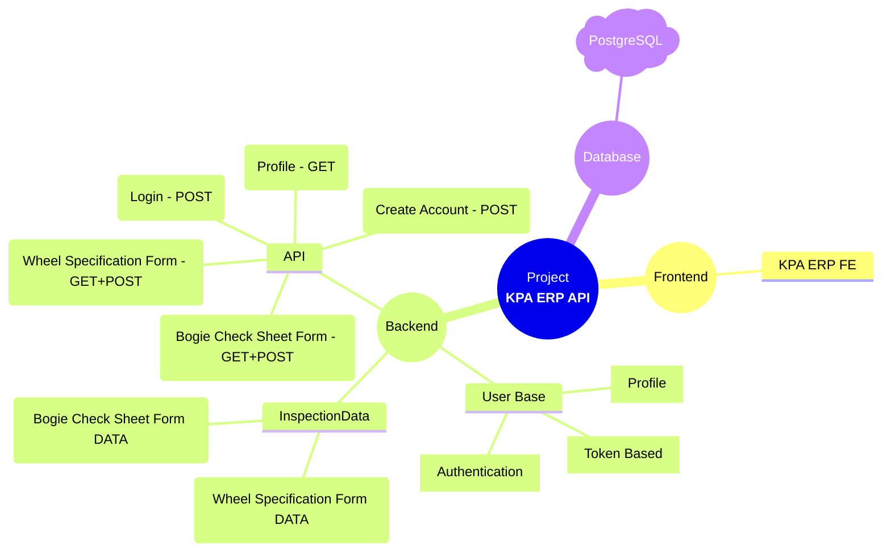

# 🏕️ KPA-ERP-API 
- > (Framework: Django Rest Framework)
- >_An API server to store and fetch informations about train possibly. One can Create/Store/update Wheel and Bogie Specifications_

---
---

## 🏜️ Visual Structure


---
---

## 🧰 Features(API end-points)

1. ✅ LOGIN Auth - POST
    - => ```baseURL/api/user/login```
        - _description_ : Using two fields `phone` and `password` we can request for login to fetch one access_token and user data. 
---

2. ✅ Create Account Auth - POST
    - => ```baseURL/api/user/register```
        - _description_ : Using some fields like `phone_number`,`email`, `firstname`, `lastname`, `user_type` and `password` etc. we can request to create an account & access_token and user data.
---
3. ✅ User Profile- Auth - GET
    - => ```baseURL/api/user/profile```
        - _description_ : Using This API we can fetch one's Porfile infos like `id`, `name`, `phone number` etc. (**Header** - Token/any required for authentication)
---
4. ✅ Bogie_Checksheet Fetch - GET 
    - => ```baseURL/api/forms/bogie-checksheet```
        - _description_ : Using this API end-point user can fetch previously submitted `bogie checksheet form` data using parameters.(**Header** - Token/any required for authentication)
---
5. ✅ Wheel_Specifications Fetch - GET
    - => ```baseURL/api/forms/wheel-specifications```
        - _description_ : Using this API end-point user can fetch previously submitted `Wheel Specification form` data using parameters.(**Header** - Token/any required for authentication)
---
6. ✅ Bogie_Checksheet Create - POST 
    - => ```baseURL/api/forms/bogie-checksheet```
        - _description_ : User Can create a new Bogie Checksheet Form Data by POST request in this API end-point. (**Header** - Token/any required for authentication)
---
7. ✅ Wheel_Specifications Create - POST
    - => ```baseURL/forms/wheel-specifications```
        - _description_ : User Can create a new Wheel Specifications Form Data by POST request in this API end-point. (**Header** - Token/any required for authentication)


---
---
## 🧰 Limitations or Assumptions

 baseURL = [http://127.0.0.1:8000](http://127.0.0.1:8000)    [Consider Accordingly]

✅ **Assumptions**
 
 1. Every **formNumber** always **Unique**.

 2. I used **Token** based authentication.
    - suggestion : if you run this to your machine you should give that Token(access_token) get from Login/new Sign Up.

 4. During GET request 3 specific parameters [if any new we have to modify].

 5. Front-end Provide Username everytime [submittedBy, inspectionBy]
 
    - suggestion : Backend can handle this form Authorized User Token/any else.",

---
---

## 🛠️ Tech Stack

- **Server:** ``Python, Django, Django Rest Framework``

- **Python Libraries:** ```asgiref==3.9.1, django==5.2.4, django-cors-headers==4.7.0, djangorestframework==3.16.0, psycopg2-binary==2.9.10, python-dotenv==1.1.1, sqlparse==0.5.3, tzdata==2025.2```

- **Database:** ``PostgreSQL`` (For Testing/Development)

---
---

## 📁 Folder Structure

```
kpa-erp-api/
│
├── postman-collection/   <-------------------------- API Calling and Responce Data Postman Collection
│   └── KPA_API_Developed_by_Saidul.postman_collection.json
│
├── ProjectRoot/   <--------------------------Project Root
│   ├── __init__.py
│   ├── asgi.py
│   ├── wsgi.py
│   ├── settings.py
│   └── urls.py
├── InspectionData/
│   ├── __ init__.py
│   ├── admin.py
│   ├── apps.py
│   ├── models.py
│   ├── test.py
│   └── views.py
├── Users/
│   ├── __init__.py
│   ├── admin.py
│   ├── apps.py
│   ├── manager.py
│   ├── models.py
│   ├── test.py
│   └── views.py
├── api/
│   ├── __init__.py
│   ├── admin.py
│   ├── apps.py
│   ├── models.py
│   ├── test.py
│   └── views.py
├── manage.py   <--------------------------- Starting Point of the project.
├── .env        <--------------------------- Projects Secrets / You should add this file.
├── .gitignore
├── README.md
├── requirements.txt <-----------------│
├── myproject.toml   <-----------------│
├── .python-version  <-----------------├────── Project Dependencies
└── uv.lock          <-----------------│
```

---
---

## ⚙️ Installation/Project Setup

1. Clone the project:

```bash
git clone "https://github.com/saidulalimallick04/KAP-ERP-API.git"
cd KAP-ERP-API
```
---
2. Install dependencies:

- Method: 01    <--------- It Use ```requirements.txt```
```bash
pip install -r requirements.txt
```
- Method: 02 [If You Have UV Package Manager]   <--------- It Use ```pyproject.toml```
```bash
uv sync
```
---
3. Database Migrations:

- Method: 01
```bash
python manage.py makemigrations
python manage.py migrate
```
- Method: 02 [If You Have UV Package Manager]
```bash
uv run manage.py makemigrations
uv run manage.py migrate
```
---
4. Run the project:

- Method: 01
```bash
python manage.py runserver
```
- Method: 02 [If UV Package Manager]
```bash
uv run manage.py runserver
```

---
---

## 🔑 Environment Variables

To run this project, create a `.env` file in the root and add the following:

```env 
DATABASE_NAME = <Secret_Here>
DATABASE_USER = <Secret_Here>
DATABASE_PASSWORD = <Secret_Here>
DATABASE_HOST = <Secret_Here>
DATABASE_PORT = <Secret_Here>
```
``` env1 
DATABASE_NAME = 'assignment_db'  <----------│
DATABASE_USER = 'postgres'  <---------------│
DATABASE_PASSWORD = '5555'  <---------------├──────> Eg. Test Conditions[Consider Accordingly]
DATABASE_HOST = 'localhost'  <--------------│
DATABASE_PORT = '5432'   <------------------│
```

---
---

## 📦 Deployment

- <Not_Necessary> [It's an **assignmant** task.]

---
---
## 📜 License

- <Private_License> [for only **Sarva Suvidhan Pvt. Ltd.**]

---
---
## 👨‍💻 Author


- > I am passionate developers building real-world solutions with creativity, collaboration, and clean code.

|Profile                                                                                                   | Name                          | Role                                              | GitHub                                                             | LinkedIn                                                                                |
|----------------------------------------------------------------------------------------------------------|-------------------------------|---------------------------------------------------|--------------------------------------------------------------------|-----------------------------------------------------------------------------------------|
| [](https://github.com/saidulalimallick04)      | Saidul Ali Mallick (Sami)     | Backend Developer, API developer & Tester         | [@saidulalimallick04](https://github.com/saidulalimallick04)       | [@saidulalimallick04](https://linkedin.com/in/saidulalimallick04)                       |

- > ❤️ I believe in building impact, not just writing code.


---
---